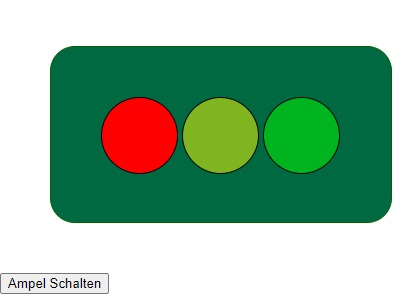

# 🚥 Traffic light

In dieser übung werden dir die grundlagen der Programmierung näher gebracht. Du wirst alles notwendige lernen um zu starten und deine eigenen ideen zu verwirklichen. Dabei ist es für mich wichtig das ich dir den anfang so einfach wie möglich mache und dir die notwendigen schritte bei bringe damit du selbstständig arbeiten kannst. Folgende grundvorrausetzungen solltest du erfüllen:

* Spaß am Lernen
* Spaß am Tüfteln
* Kreativität

Viel mehr braucht es nicht um die ersten schritte in die programmierung zu wagen. Naja ein Computer wäre noch nicht schlecht und eine Internet verbingung 😊

Wenn alles klappt wirst du am ende eine kleine webseite haben mit einer funktionierenden ampel!




# Inhaltsverzeichnis
1. [Einleitung](#📣-einleitung)
2. [Was ist HTML](#🤔-was-ist-html)
    1. [Übung](#📃-die-erste-webseite)
3. [Was ist CSS?](#🤔-was-ist-css)
    1. [Übung](#🏳️‍🌈-jetzt-wird-es-bunt)
4. [Was ist JavaScript](#🤔-was-ist-javascript)
    1. [Übung](#🚥-programmiern-wir-unsere-ampel)


## 📣 Einleitung

Hier werden dir einige grundlagen vermittelt um die kommenden übungen erfolgreich zu meistern und zu verstehen wie eine eigene Webseite entsteht. Das was du heute siehst wenn du im internet surfst basiert auf drei fundermentalen Technologien. __HTML__, __CSS__ und __JavaScript__. Jedes grundlagen kapitel hat eine kleine übung um das gelernte direkt anzuwenden. Wenn es einmal haken sollte, keine scheu vor fragen!


### 🤔 Was ist HTML?

Die __HyperText Markup Language__ beschreibt wie eine Web seite aufgebaut ist. Mit __HTML__ beschreiben wir was in einer Liste, Tabelle oder Absatz geschrieben steht. Es ist wichtig zu verstehen wie __HTML__ funktioniert damit wir später erfolgreich sind. HTML strukturiert also unsere webseite. 

```html
<ul>
    <li> Eintrag #1 </li>
    <li> Eintrag #2 </li>
    <li> Eintrag #3 </li>
</ul>

```

Dir fallen sicherlich die *größer* (>) und *kleiner* (<) zeichen auf, hiermit wird ein sogenanntes tag beschrieben. Dies sagt deinem Webbrowser: "Hey hier kommt gleich etwas", in diesem fall eine *unsortierte liste* `<ul>`. Ohne einträge wäre unsere liste ziemlich leer, also definieren wir *list items* `<li>`. Jedes tag tritt in einem paar auf, einem öffnendem tag `<ul>` bzw. `<li>` und einem schließendem tag `</ul>` bzw. `</li>`. In unserem beispiel beschreiben wir also die Struktur unserer Liste mit dem geöffnetem `<ul>` tag, schreiben drei `<li>` tags und beenden unsere liste mit dem schließendem `</ul>` tag.

Vieleicht kannst du jetzt schon eine struktur/hirachie erkennen, wenn ja. Herzlichen Glückwunsch du hast das konzept von html verstanden! Dir fehlen jetzt noch einige vokabeln diese kannst du hier nachschlagen:

https://developer.mozilla.org/en-US/docs/Web/HTML/Element

Es kann ziemlich einschüchtern sein seine erste webseite zu programmieren. Daher werde ich dir ein kleien starthilfe an die hand geben, jede webseite fäng mit dem gleichen Grundgerüst an welches ich dier hier einmal zeige damit du es später in eine eigene datei kopieren kannst.

```html
<!DOCTYPE html>
<html lang="en">
<head>
    <meta charset="UTF-8">
    <meta name="viewport" content="width=device-width, initial-scale=1.0">
    <title>Document</title>
</head>
<body>
    <!-- Unsere Webseite ist hier -->
</body>
</html>

```

Schlag ruhig einige der **tags** nach um zu verstehen was sie tun. Zusätzlich siehst du auch *Atrtibute* der tags. diese kannst du vorerst ignorieren. Alles was wir zwischen das `<body>` tag schreiben ist das was wir später in unserem webbrowser sehen werden. Ich verrate dir eine kleines geheimnis, wenn du HTML verstanden hast, dann kannst du nun auch XML! Ein wichtiges format was Softwareentwickler häufig benutzen um daten auszutauschen. Cool oder? Der erst schritt ist getan für deine Karriere!🧑‍💼

> ℹ️ Wusstest du das du dir den Quelltext (die struktur) jeder webseite einfach so anschauen kannst? Wenn du im internet unterwegs bist, öffne doch einmal die Entwicklerwerkzeuge (meistens mit der taste F12). Elements zeigt dir die struktur der webseite, du kannst sie sogar ändern! Cool was? Bedenke jedoch das die änderungen nur bei dir stattfinden mit der Kopie die dein webbrowser aus dem internet geladen hat, lädst du die seite neu sind deine änderungen leider wieder weg.  

#### 📃 Die Erste Webseite

Erstelle eine eigene datei mit dem namen `index.html` und öffne diese mit __notepad__. Dein betriebssystem wird versuchen die datei mit dem Installierten webbrowser zu öffnen wenn du sie starten willst. Also öffne zuerst notepad und navigieren dann zu der datei.

Vergiss nicht die basis struktur anzulegen!

Wir wollen uns eine Kleine ampel bauen 🚦, welches tag könnte man dafür verwenden? Füge eine Überschrift für deine seite ein und einen text der etwas über dich erzählt.

### 🤔 Was ist CSS ?

Wenn html und sie struktur einer webseite vorgibt fehlen uns noch informationen **WIE** wir die struktur anzeigen wollen. Hierfür gibt es die __Cascading Style Sheets__, der name ist programm denn hier beschreiben wir wie unsere tags aussehen sollen. Falls du schon vorgearbeitet hast wirst du festgestellt haben das selbst ohne diese angaben du etwas sehen kannst. Die webbrowser haben ein, zugegebener maßen nicht sehr schönes, standart style sheet.

Es kann etwas kompliziert sein zu verstehen wie CSS funktioniert, da hilft nur ausprobieren!
CSS besteht aus zwei teilen, einem Selektor der dem Webbrowser sagt welches tag wir schön machen wollen und den eigenschaften. Die eigenschaften beschreiben farbe, position, größe und so weiter. Hier ein kleines beispiel unserer liste:

```css
li {
    color: red;
}
```

Hier siehst du das wir alle `li` tags selektieren, in den geschweiften klammern beschreiben wir was passieren soll. Wir setzen die das attribut `Color` auf `red`. Die gilt nun für alle `li` elemente auf unserer webseite. CSS kann sehr verwirrend sein daher will ich dir zwei webseiten an die hand geben die das thema weiter erklären. Keine sorge du ich zeig dir noch einen kleinen trick um das ganze etwas einfacher zu machen

* https://en.wikipedia.org/wiki/CSS
* https://wiki.selfhtml.org/wiki/CSS


Erinnerst du dich noch daran das ich sagte das du die HTML-*Attribute* erstmal vergessen sollst? Jetzt haben wir den salat, um CSS etwas einfacher zu machen brauchen wir zwei attribute um uns eine menge arbeit zu ersparen. Wir können an jedes tag das attribut __id__ oder __class__ schreiben. Der unterschied ist das wir erwarten das auf einer gesammten seite __id__ nicht noch einmal vorkommt, __class__ beschreibt also elemente einer gleichen gruppe.  Wenn es dir geht wie mir dann ist es einfacher zu verstehen wenn wir ein beispiel haben:

```html
<!DOCTYPE html>
<html lang="en">
<head>
    <meta charset="UTF-8">
    <meta name="viewport" content="width=device-width, initial-scale=1.0">
    <title>Document</title>
</head>
<body>
    <!-- Unsere Webseite ist hier -->
    <!-- Erste Liste -->
    <ul id="liste-eins">
        <li class="rot"> Eintrag #1 </li>
        <li class="rot"> Eintrag #2 </li>
        <li class="rot"> Eintrag #3 </li>
    </ul>   
    <!-- Zweite List -->
    <ul id="liste-zwei">
        <li class="blau"> Eintrag #1 </li>
        <li class="rot"> Eintrag #2 </li>
        <li class="blau"> Eintrag #3 </li>
    </ul>
</body>
</html>
```
Wie du siehst haben wir zwei `ul`-Listen beide haben nun das attribut __id__ und einen eindeutigen wert(`liste-eins` und `liste-zwei`). Unsere list items (`li`) haben klassen bekommen. Wie gesagt ID düfen sich nicht widerholen, classes schon. Probierst du das schon aus? Dann wirst du feststellen das sich nichts geändert hat. Wir müssen ja noch beschreiben was passieren soll wenn ein tag eine id oder eine klasse hat

```css
.blau {
    background-color: white;
    color: blue;
}
.rot {
    background-color: black;
    color: red;
}

#liste-eins {
    background-color: green;
    font-weight: bold;
}

#liste-zwei {
    background-color: yellow;
    font-weight: bold;
}

```
Oh man das ist ganzschön viel was? Schauen wir einmal ob wir hier ein muster erkennen können. Es scheint so als ob unsere __id__ attribute mit einem `#` selektiert werden gefolgt von dem attribut wert. Ähnliches gilt für unsere klassen diese fangen einfach mit einem `.` an. In den geschweiften klammern stehen nun mehrere anweisungen um den hintergrund, die schrift stärke und farb zu definieren. Siehst du wie alle einträge unserer liste fett gedruckt werden? Das liegt daran das die `li` tags in unseer struktur "unter" unserer liste liegen und damit von unserem styling der liste profitieren.

#### 🏳️‍🌈 Jetzt wird es Bunt

Unsere ampel sieht noch etwas trist aus und irgendwie überhaupt nicht wie ein ampel. Niemand wird sie ernst nehmen! Färbe deine Lampen (rot, grün, gelb) ein, denk daran das die ampel selber auch eine farbe hat. Du kannst so gut wie alle style eigenschaften eines elementes ändern! Z.b. Rundungen, Rahmen, farbe, breite und höhe! Schau dir noch einmal dieses bild an, goodle kann eine wichitige hilfe sein wenn du weißt die richtigen fragen zu stellen. 🥷 Goodle-fu!


### 🤔 Was ist JavaScript?

Bislang haben wir noch nicht wirklich programmiert. Wir haben nur die struktur unserer ampel beschrieben und wie sie auszusehen hat. Programmiersprachen sind dafür da Computern zu sagen was sie zu tun haben. Computer als solch sind ziemlich faul und dumm und solange man ihnen nicht sagt das sie etwas tun sollen und was sie tun sollen machen sie nichts.

Programmieren hört sich erst einmal sehr schwierig an, ist es aber nicht. Programmiersprachen sind wie jede andere sprache auch auf gebaut und wir müssen Gramatik und Vokabeln lernen. Dazu kommt noch ein wenig mathematik. Das gute ist, Computer sagen uns ziemlich schnell wenn sie uns nicht verstehen.

Willst du die beispiele direkt ausprobieren? Benutz https://jsfiddle.net/! 

```javascript

let x = 10;
let ergebnis = x * 2;

window.alert("Zwei mal X ist gleich " + ergebnis);

```
Oh mein gott was passiert hier? Gehen wir einmal zeile für zeile durch:

* `let x = 10` hier sagen wir dem computer das x = 10 ist. 
* `let ergebnis = x * 2` hier möchten wir das der computer für uns 2 mal x rechnent
* `window.alert("Zwei mal X ist gleich " + ergebnis)` hier geben wir unser ergebnis aus
    * `"Zwei mal X ist gleich " + ergebnis` hier bauen wir uns einen text zusammen mit dem ergebnis
    * `window.alert` hier sagen wir dem computer das er das ergebnis anzeigen soll.

Puh, ganzschön viel zu schreiben für so eine einfache aufgabe, naja Computer sind halt richtig dumme taschen rechner!

Du hast jetzt schon gelernt was variabeln sind und was man mit ihnen machen kann. Computer können noch ein wenig mehr, sie können einfache entscheidungen treffen. Aller dings müssen wir ihnen wagen was passieren muss ein einfachen `wenn` `dann` anweisungen

```javascript
let zahl = 1337;
let tipp = window.prompt("An welche Zahl denke ich?");

if(tipp == zahl) {
    window.alert("Verdammt, du bist gut!");
} else {
    window.alert("Ha ha, nein das war nicht meine zahl!");
}

```

`if` vergleicht nun die eingabe mit der zahl die sich unser computer "ausgedacht" hat... ich glaube du kannst das sicherlich schon etwas besser machen hier an der stelle so das der computer sich eine zahl zwischen 1 und 10 ausdenknkt (tipp: [Math.random](https://developer.mozilla.org/en-US/docs/Web/JavaScript/Reference/Global_Objects/Math/random))

Du kennst schon einige vokabeln und und ein wenig gramatik, einen letzten wichtigen punkt müssen wir noch besprechen. Funktionen. Wie der name schon sagt brinen wir unserem Computer eine neue funktion bei. Fuktionen kennst du vilicht schon aus der mathematik. __f(a,b) = a + b__ brechnent a+b in javascript würde es so aussehen

```javascript

function addiereZweiZahlen (zahl1, zahl2) {
    return zahl1 + zahl2;
}
```
`zahl1` und `zahl2` sind unsere parameter und `return` sagt das wir etwas zurück erwarten. Doch wie rufen wir eine solche funktion auf?

```html
<script type="text/javascript">
    function greeting(){
        val name = window.prompt("Wie heißt du?");
        window.alert("Hallo " + name + "!");
    }
</script>

<button onclick="greeting()">Hallo!</button>
```
Wir nutzen hier ein wenig ``html`` um einen knopf einzufügen, und sagen dem computer das er die funktion ``greeting`` aus führen soll wenn jemand auf den knopf drückt.

Wenn du mehr über javascript, lernen möchtest schau einmal hier vorbei:

* https://developer.mozilla.org/en-US/docs/Web/JavaScript

#### 🚥 Programmiern wir unsere Ampel

Nun wird es ernst, wir brauche eine funktion die unsere Ampel schaltet wenn der benutzer einen knopf drückt. Ich gebe dir noch 2 kleine hilfen damit es nicht zu schwer wird:

* `` document.querySelector("")`` ist eine funktion mit der du in JavaScript ein tag suchen kannst auf deiner webseite ähnlich wie in css
* ``document.querySelector("").classList = ""`` so kannst du die klassen des elementes angeben.

Denk dran du kannst jederzeit fragen stellen!
